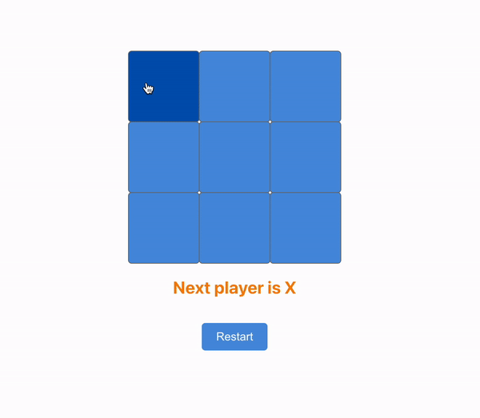

# Tic-Tac-Toe-Game

we need to create 3 Rows
each row should have 3 squares 

so how it will work?
whenever user clicks on squares it should be X or O
for each square there will be state

so first we have a state for each square as we have 9 squares
const [squares, setSquares] = useState(Array(9).fill(''));

when a player wins we should return the winner result and have a button to reset/restart the games 
if all squares filled and no winners so we need to return Draw result with reset 

here we start with X state
const [isXTurn, setIsXTurn] = useState(true);

in return we need to have identifier for each square by index number in array like

return (
    

      

        <Square onClick={() => handleClick(0)} />
        <Square onClick={() => handleClick(1)} />
        <Square onClick={() => handleClick(2)} />
      

      

        <Square onClick={() => handleClick(3)} />
        <Square onClick={() => handleClick(4)} />
        <Square onClick={() => handleClick(5)} />
      

      

        <Square onClick={() => handleClick(6)} />
        <Square onClick={() => handleClick(7)} />
        <Square onClick={() => handleClick(8)} />
      

    

  );
}

now let’s create function to handle the clicks
 function handleClick(getCurrentSquare) {
    let cpySquares = [...squares];
    cpySquares[getCurrentSquare] = isXTurn ? "X" : "O";
    setIsXTurn(!isXTurn);
    setSquares(cpySquares);  }

we check if X true so add X otherwise add O
then we switch X to false and vice versa of 
  const [isXTurn, setIsXTurn] = useState(true);

by 
  setIsXTurn(!setIsXTurn);

then   setSquares(cpySquares);}

now we need to pass the value to each square like

 

        <Square value={squares[0]} onClick={() => handleClick(0)} />
        <Square value={squares[1]} onClick={() => handleClick(1)} />
        <Square value={squares[2]} onClick={() => handleClick(2)} />
      

      

        <Square value={squares[3]} onClick={() => handleClick(3)} />
        <Square value={squares[4]} onClick={() => handleClick(4)} />
        <Square value={squares[5]} onClick={() => handleClick(5)} />
      

      

        <Square value={squares[6]} onClick={() => handleClick(6)} />
        <Square value={squares[7]} onClick={() => handleClick(7)} />
        <Square value={squares[8]} onClick={() => handleClick(8)} />
      

now we need to check two things 
- if square is full with value to not allow to change value on click
- if there is a winner or a draw we stop the game

for if square is full with value to not allow to change value on click
we add
if (getWinner(cpySquares) || cpySquares[getCurrentSquare]) return;

Now how we calculate the winner?
we create a function to check the patterns like we have squares of
// 0 1 2
// 3 4 5
// 6 7 8

  function getWinner(squares) {
    const winningPatterns = [
      [0, 1, 2],
      [3, 4, 5],
      [6, 7, 8],

      [2, 5, 8],
      [1, 4, 7],
      [0, 3, 6],

      [0, 4, 8],
      [2, 4, 6],
    ];
    for (let i = 0; i < winningPatterns.length; i++) {
      const [x, y, z] = winningPatterns[i];

      if (
        squares[x] &&
        squares[x] === squares[y] &&
        squares[x] === squares[z]
      ) {
        return squares[x];
      }
    }
    return null;
  }

now we need to have a state of status 
 const [status, setStatus] = useState('');

useEffect Hook

  useEffect(() => {
    if (!getWinner(squares) && squares.every((item) => item !== "")) {
      setStatus(`This is a Draw ! Please Restart the Game`);
    } else if (getWinner(squares)) {
      setStatus(`Winner is ${getWinner(squares)}. Please restart Game`);
    } else {
      setStatus(`Next player is ${isXTurn ? "x" : "o"}`);
    }
  }, [squares, isXTurn]);

then down render the status
  <h1>{status}</h1>

add a button to restart
 <button onClick={handleRestart}>Restart</button>

create restart method
  function handleRestart() {
    setIsXTurn(true);
    setSquares(Array(9).fill(""));
  }

------------
Props:
value: The value of the square ("X", "O", or empty).
onClick: Function to call when the square is clicked.

TicTacTeo Component
The component manages the state of the game and contains the main game logic.
State Management:
squares: An array representing the state of each square on the board.
isXTurn: A boolean indicating whether it is X's turn.
status: A string indicating the current status of the game.
getWinner Function:
This function checks the current board (squares) for any winning patterns.
If a winning pattern is found, it returns the winner ("X" or "O").
If no winner is found, it returns null.
handleClick Function:
This function is called when a square is clicked.
It creates a copy of the current squares (cpySquares).
If there is already a winner or the clicked square is not empty, the function returns early.
Otherwise, it updates the clicked square with the current player's symbol (X or O), toggles the turn, and updates the state.
handleRestart Function:
This function resets the game to its initial state by clearing the board and setting isXTurn to true.
useEffect Hook:
This hook updates the game status whenever squares or isXTurn changes.
It checks if the game is a draw (all squares are filled with no winner).
It sets the status to indicate the winner if there is one.
Otherwise, it updates the status to indicate the next player's turn.
Rendering:
The game board is rendered as a grid of Square components.
The status of the game is displayed in an <h1> element.
A "Restart" button is provided to reset the game.
